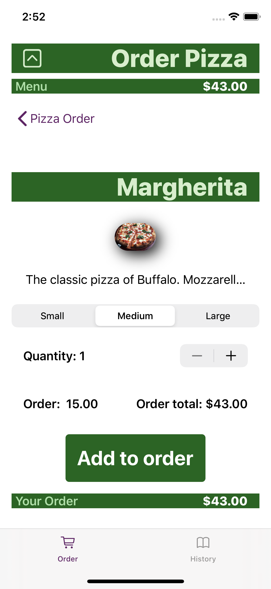
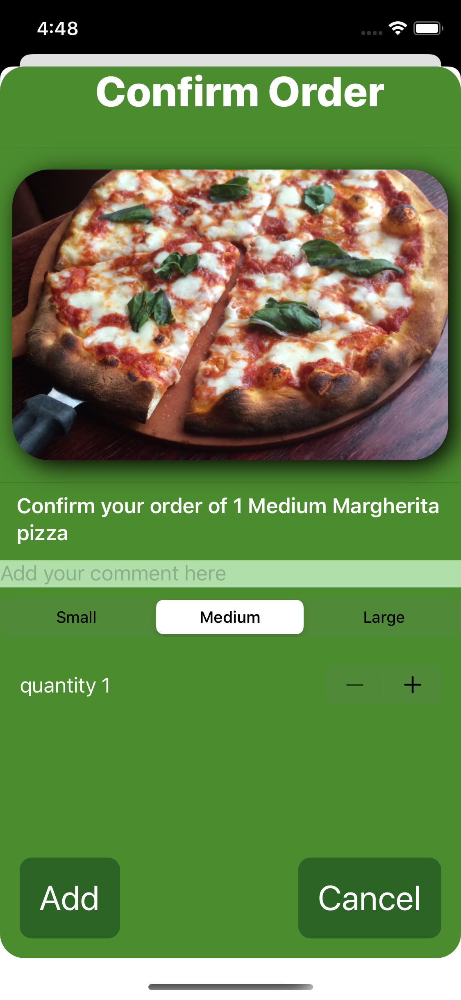

# PizzaOrder

Building a Pizza App using the SwiftUI framework.

SwiftUI essential training tutorial: Chapter 1 to 3 is more about design, while chapter 4 really enter into Swift. The framework Combine, wrappers like @Published, @State, @ObservedObject, @ObjectBinding and @EnvironmentObject are also discussed.

Link to the tutorial: https://www.linkedin.com/learning/swiftui-essential-training/

<h2>Screenshots:</h2>

   
   
  

